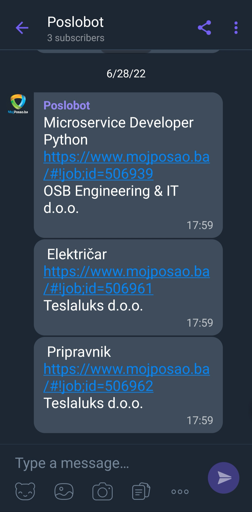

# Poslobot    
* Viber bot that scrapes MojPosao.ba and sends daily updates
* uses Viber Python bot interface and REST API
* backend: Flask + PostgreSQL 
* scraping: Scrapy
* daily updates via Zapier
* deployed on Heroku

# Sample Screen

